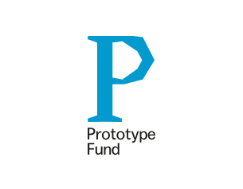
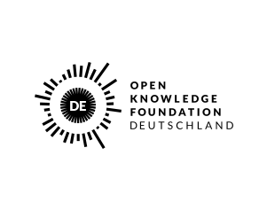

# shig-js-sdk

Shig Client-Server SDK for JavaScript

## Development
The Lobby web component is based on the `Shig/core` library. For development, please follow the instructions in the ``Shig/core`` [README](https://github.com/shigde/shig-js-sdk/tree/main/projects/core#readme).

## Download Lobby web component artifact
Please download the last tagged version

## Build Lobby web component artifact

Run `npm run build:lobby` to build the lobby web component. The build `shig-lobby.js` artifacts will be stored in
the `dist/lobby` directory.

## Use web component

```html
<!DOCTYPE html>
<html lang="en">
<head></head>
<body>
<div id="wrapper"></div>
<script type="text/javascript" src="./shig-lobby.js"></script>
<script type="text/javascript">
  const lobby = document.createElement('shig-lobby');
  lobby.addEventListener('loadComp', (event) => {
    console.log("Component loaded successfully!", event);
  });
  
  // settings:
  lobby.setAttribute('token', 'your-proxy-api-token');
  lobby.setAttribute('api-prefix', '/your/proxy/api/prefix');
  lobby.setAttribute('stream', '1234');
  lobby.setAttribute('space', 'mychannel@video.shig.de');
  lobby.setAttribute('user', 'user@video.shig.de');
  
  const wrapper = document.getElementById("wrapper");
  wrapper.appendChild(lobby);
</script>
</body>
</html>
```

You can find the complete list of parameters here: [Parameter](https://github.com/shigde/shig-js-sdk/tree/main/projects/core#readme)

## Funded by

<p style="display: flex; flex-direction: row; justify-content: flex-start; align-items: center;">
<a href="https://www.bmbf.de/bmbf/en" rel="nofollow"></a>&nbsp; &nbsp; &nbsp; &nbsp; &nbsp; &nbsp; <a href="https://prototypefund.de/en/" rel="nofollow"></a>&nbsp; &nbsp; &nbsp; &nbsp; &nbsp; &nbsp; <a href="https://okfn.de/en/" rel="nofollow"></a>
</p>
